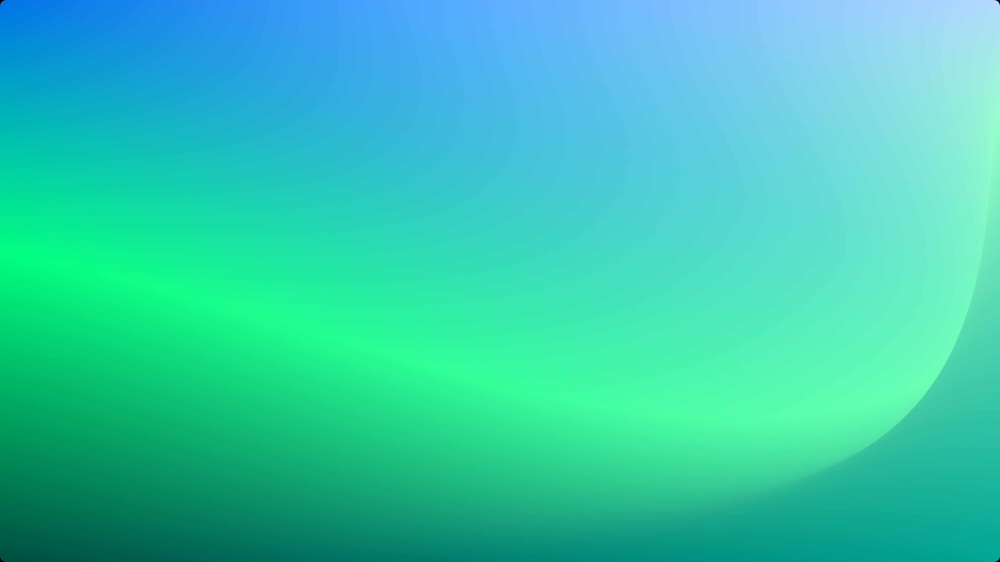

# MeshingKit




MeshingKit provides an easy way to create mesh gradients in SwiftUI with predefined gradient templates to directly render beautiful, gorgeous gradients!

## Support

Love this project? Check out my books to explore more of AI and iOS development:
- [Exploring AI for iOS Development](https://academy.rudrank.com/product/ai)
- [Exploring AI-Assisted Coding for iOS Development](https://academy.rudrank.com/product/ai-assisted-coding)

Your support helps to keep this project growing!

## Meshing

MeshingKit is based on [Meshing](https://apps.apple.com/in/app/ai-mesh-gradient-tool-meshing/id6567933550), an AI Mesh Gradient Tool.

## Features

- Create beautiful mesh gradients with customizable control points and colors
- Animate gradients with smooth, configurable transitions
- 63 predefined gradient templates:
  - 30 templates with 2x2 grid size
  - 22 templates with 3x3 grid size
  - 11 templates with 4x4 grid size
- Easily extendable for custom gradients
- Works across all Apple platforms (iOS, macOS, tvOS, watchOS, visionOS)

## Requirements

- iOS 18.0+, macOS 15.0+, tvOS 18.0+, watchOS 11.0+, visionOS 2.0+
- Swift 6.0+
- Xcode 16.0+

## Installation

### Swift Package Manager

Add MeshingKit to your project using Swift Package Manager. In Xcode, go to File > Swift Packages > Add Package Dependency and enter the following URL:

```
https://github.com/rryam/MeshingKit.git
```

## Usage

To use a predefined gradient template:

```swift
import SwiftUI
import MeshingKit

struct ContentView: View {
    var body: some View {
        MeshingKit.gradientSize3(template: .cosmicAurora)
            .frame(width: 300, height: 300)
    }
}
```

## Animated Gradient Views

To create an animated gradient view:

```swift
import SwiftUI
import MeshingKit

struct AnimatedGradientView: View {
    @State private var showAnimation = true

    var body: some View {
        MeshingKit.animatedGradientSize3(template: .cosmicAurora, showAnimation: $showAnimation)
            .frame(width: 300, height: 300)
            .padding()

        // Toggle animation
        Toggle("Animate Gradient", isOn: $showAnimation)
            .padding()
    }
}
```

## Noise Effect with Gradients

You can add a noise effect to your gradients using the ParameterizedNoiseView:

```swift
import SwiftUI
import MeshingKit

struct NoiseEffectGradientView: View {
    @State private var intensity: Float = 0.5
    @State private var frequency: Float = 0.2
    @State private var opacity: Float = 0.9

    var body: some View {
        ParameterizedNoiseView(intensity: $intensity, frequency: $frequency, opacity: $opacity) {
            MeshingKit.gradientSize3(template: .cosmicAurora)
        }
        .frame(width: 300, height: 300)

        // Controls for adjusting the noise effect
        VStack {
            Slider(value: $intensity, in: 0...1) {
                Text("Intensity")
            }
            .padding()

            Slider(value: $frequency, in: 0...1) {
                Text("Frequency")
            }
            .padding()

            Slider(value: $opacity, in: 0...1) {
                Text("Opacity")
            }
            .padding()
        }
    }
}
```

## Available Gradient Templates

MeshingKit provides three sets of predefined gradient templates:

### GradientTemplateSize2 (2x2 grid)

- mysticTwilight
- tropicalParadise
- cherryBlossom
- arcticFrost
- goldenSunrise
- emeraldForest
- desertMirage
- midnightGalaxy
- autumnHarvest
- oceanBreeze
- lavenderDreams
- citrusBurst
- northernLights
- strawberryLemonade
- deepSea
- cottonCandy
- volcanicAsh
- springMeadow
- cosmicDust
- peacockFeathers
- crimsonSunset
- enchantedForest
- blueberryMuffin
- saharaDunes
- grapeSoda
- frostyWinter
- dragonFire
- mermaidLagoon
- chocolateTruffle
- neonNights

### GradientTemplateSize3 (3x3 grid)

- intelligence
- auroraBorealis
- sunsetGlow
- oceanDepths
- neonNight
- autumnLeaves
- cosmicAurora
- lavaFlow
- etherealMist
- tropicalParadise
- midnightGalaxy
- desertMirage
- frostedCrystal
- enchantedForest
- rubyFusion
- goldenSunrise
- cosmicNebula
- arcticAurora
- volcanicEmber
- mintBreeze
- twilightSerenade
- saharaDunes

### GradientTemplateSize4 (4x4 grid)

- auroraBorealis
- sunsetHorizon
- mysticForest
- cosmicNebula
- coralReef
- etherealTwilight
- volcanicOasis
- arcticFrost
- jungleMist
- desertMirage
- neonMetropolis

## Custom Gradients

Ccreate custom gradients by defining your own `GradientTemplate`:

```swift
let customTemplate = GradientTemplate(
    name: "Custom Gradient",
    size: 3,
    points: [
        .init(x: 0.0, y: 0.0), .init(x: 0.5, y: 0.0), .init(x: 1.0, y: 0.0),
        .init(x: 0.0, y: 0.5), .init(x: 0.5, y: 0.5), .init(x: 1.0, y: 0.5),
        .init(x: 0.0, y: 1.0), .init(x: 0.5, y: 1.0), .init(x: 1.0, y: 1.0)
    ],
    colors: [
        Color.red, Color.orange, Color.yellow,
        Color.green, Color.blue, Color.indigo,
        Color.purple, Color.pink, Color.white
    ],
    background: Color.black
)

let customGradient = MeshGradient(
    width: customTemplate.size,
    height: customTemplate.size,
    points: customTemplate.points,
    colors: customTemplate.colors
)
```

## Hex Color Initialization

There is an extension on `Color` that allows to initialise colors using hexadecimal strings:

```swift
let color = Color(hex: "#FF5733")
```

This extension supports various hex formats:

- "#RGB" (12-bit)
- "#RRGGBB" (24-bit)
- "#AARRGGBB" (32-bit with alpha)

## Contributing

Contributions to MeshingKit are welcome! Please feel free to submit a Pull Request.

## License

MeshingKit is available under the MIT license. See the LICENSE file for more info.
